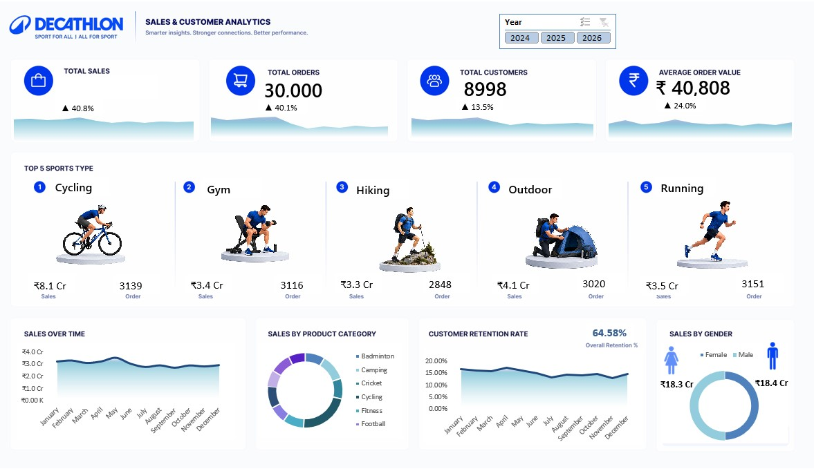

# 📊 Sales & Customer Analytics Dashboard (Decathlon Dataset)


---

# 📌 Project Overview

This project presents an interactive **Sales & Customer Analytics Dashboard** developed in **Microsoft Excel** using a synthetic **Decathlon retail dataset** containing over **30,000 records**.

The dashboard transforms raw retail data into meaningful business insights by analyzing sales performance, customer behavior, order trends, and key performance indicators (KPIs). It enables stakeholders to monitor business performance through an intuitive and interactive reporting interface.

---

# 🎯 Business Problem

Retail businesses generate large volumes of transactional data every day. Without proper analysis, it becomes difficult to identify:

- Sales trends
- Customer purchasing behavior
- High-performing product categories
- Customer retention patterns
- Business growth opportunities

The objective of this dashboard is to convert raw sales data into actionable business insights that support informed decision-making.

---

# 📁 Dataset Information

| Attribute      | Details                     |
| -------------- | --------------------------- |
| Dataset        | Decathlon Synthetic Dataset |
| Records        | 30,000+                     |
| Industry       | Retail                      |
| File Format    | Excel (.xlsx)               |
| Dashboard Tool | Microsoft Excel             |

---

# 🛠 Tools & Techniques

- Microsoft Excel
- Pivot Tables
- Pivot Charts
- Slicers
- KPI Cards
- Conditional Formatting
- Data Cleaning
- Data Validation
- Interactive Dashboard Design

---

# 📊 Dashboard KPIs

The dashboard tracks the following business metrics:

- 💰 Total Sales
- 📦 Total Orders
- 👥 Total Customers
- 🛒 Average Order Value (AOV)

---

# 📈 Dashboard Analysis

The dashboard provides interactive analysis for:

- Monthly Sales Trend
- Product Category Performance
- Customer Retention
- Gender Distribution
- Customer Segment Analysis
- Age Group Analysis

Users can filter the dashboard dynamically using slicers for better business exploration.

---

# 🔍 Business Questions Answered

This dashboard helps answer questions such as:

- How is sales performance changing over time?
- Which customer segments generate the highest revenue?
- Which product categories perform the best?
- What is the customer retention trend?
- How does gender influence purchasing behavior?
- Which age groups contribute the most to sales?

---

# 💡 Key Insights

- Sales trends help identify seasonal business patterns.
- Customer segmentation reveals high-value customer groups.
- Product category analysis highlights major revenue contributors.
- Customer retention metrics help evaluate repeat purchasing behavior.
- Interactive filtering enables faster business reporting and analysis.

---

# 💼 Business Recommendations

Based on the dashboard analysis:

- Focus marketing campaigns on high-value customer segments.
- Increase inventory for top-performing product categories.
- Design retention programs for repeat customers.
- Optimize promotions based on seasonal sales trends.
- Monitor KPI performance regularly to improve business decisions.

---

# 📷 Dashboard Preview

> Dashboard Screenshot



---

# 🚀 Skills Demonstrated

- Advanced Excel
- Dashboard Development
- Data Cleaning
- Data Validation
- KPI Reporting
- Sales Analysis
- Customer Analytics
- Data Visualization
- Business Reporting

---

# 📂 Repository Structure

```
Sales-Customer-Analytics-Dashboard
│
├── Dashboard.xlsx
├── Dashboard.png
├── Decathlon_Synthetic_Data_30000.xlsx
└── README.md
```

---

# 🔮 Future Enhancements

- Add Power Query automation
- Develop interactive Power BI version
- Build SQL database for advanced reporting
- Implement sales forecasting
- Perform customer segmentation using Machine Learning

---

# 👨‍💻 Author

**Manish Kashyap**

📧 Email: manishkshyp0123@gmail.com

💼 LinkedIn: https://www.linkedin.com/in/%E1%B4%8D%E1%B4%80%C9%B4%C9%AA%EA%9C%B1%CA%9C-%E1%B4%8B%E1%B4%80%EA%9C%B1%CA%9C%CA%8F%E1%B4%80%E1%B4%98-32022a2aa?utm_source=share&utm_campaign=share_via&utm_content=profile&utm_medium=android_app

💻 GitHub:https://github.com/Manish-kashyap

---

⭐ If you found this project useful, feel free to star the repository.
